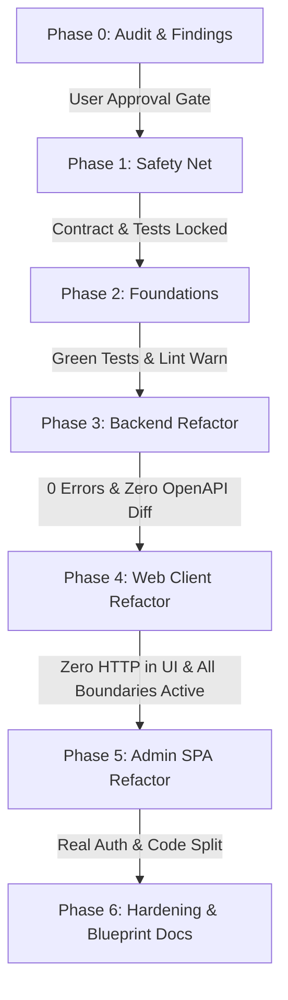

# Phase 0 — Audit & System Architecture Inventory

**Repository:** `Telecommunication` (Monorepo: `server/`, `client/`, `admin/`)  
**Audited:** 2026-09-21  
**Mode:** Strictly Read-Only (Zero application code modified)  
**Status:** Complete & Awaiting Approval for Phase 1  

---

## 0. Executive Summary & Repository Architecture

This repository is a full-stack telemedicine platform composed of three interconnected applications under the monorepo root `c:\Setu\2026\Tele`:

1. **`server/` (Backend API):**
   - **Framework & Runtime:** NestJS 12 running on Node.js with Native ESM (`"type": "module"`, `.js` extension mandatory on all relative imports).
   - **Database & ORM:** Prisma 7 with multi-file schemas (`prisma/schema/*.prisma`), `@prisma/adapter-pg`, and Neon PostgreSQL.
   - **Authentication:** Better-Auth (`@thallesp/nestjs-better-auth`) with PostgreSQL session persistence and Google OAuth.
   - **Integrations:** Cloudinary (avatars & medical reports), Google Calendar & Meet API, Nodemailer, Swagger (`/api/docs`).
   - **Active State:** Running locally on port 5000.

2. **`client/` (Patient & Doctor Web Application):**
   - **Framework & Runtime:** Next.js 16.2.10 App Router, React 19.
   - **State & Data Fetching:** TanStack Query 5, Redux Toolkit (`redux-persist`), React Hook Form + Zod.
   - **Styling:** Tailwind CSS 4, shadcn/ui.
   - **Active State:** Running locally on port 3000.

3. **`admin/` (Administration Portal SPA):**
   - **Framework & Runtime:** Vite 7, React 19, React Router 7.
   - **State & Data Fetching:** TanStack Query, Redux Toolkit, React Hook Form + Zod.
   - **Styling:** Tailwind CSS 4, shadcn/ui.
   - **Status:** Scaffolded SPA targeting administrative oversight, doctor verification, and CMS management.

*(Note on previous draft in `client/docs/refactor/00-audit.md`: That draft was produced by an isolated subagent confined to the `client/` subdirectory which mistook the scope as client-only. This document provides the authoritative, whole-repo audit across `server/`, `client/`, and `admin/`.)*

---

## 1. Baseline Quality Gates (Pre-Refactor Snapshot)

The pre-refactor quality gates were captured synchronously across all three applications:

| Application | Gate | Command | Baseline Result | Notes & Blockers |
|---|---|---|---|---|
| **Server** | Typecheck | `npx tsc --noEmit` | **PASS (0 errors)** | Clean TypeScript compilation. |
| **Server** | Lint | `npm run lint` | **PASS (0 errors, 9 warnings)** | Uses `oxlint`. Warnings are unused imports/vars. |
| **Server** | Tests | `npm test` | **FAIL (2 failed, 3 passed)** | `DoctorService` and `UsersService` tests fail because `CloudinaryService` mock is missing from test providers. |
| **Server** | Build | `npm run build` | **PASS (0 errors)** | Emits clean `dist/` bundle. |
| **Server** | OpenAPI Export | Live Swagger fetch | **PASS (Exported)** | Saved to `docs/openapi.json` (20.2 KB, 65+ endpoints). Baseline contract locked. |
| **Client** | Typecheck | `npx tsc --noEmit` | **PASS (0 errors)** | Clean TypeScript compilation. |
| **Client** | Lint | `npm run lint` | **FAIL (32 errors, 21 warnings)** | 53 issues: `no-explicit-any` (16), `react-hooks/set-state-in-effect`, `prefer-const`. |
| **Client** | Tests | `npm test` | **ABSENT** | No test runner configured in `client/package.json`. |
| **Client** | Build | `npm run build` | **Deferred to Phase 1** | Awaiting Phase 1 baseline lock. |
| **Admin** | Typecheck | `npx tsc -b` | **PENDING INSTALL** | `admin/node_modules` not installed; requires `npm install` before Phase 5. |
| **Admin** | Lint | `npm run lint` | **PENDING INSTALL** | ESLint 9 configured, waiting for dependency installation. |
| **Admin** | Tests | `npm test` | **ABSENT** | No test script in `admin/package.json`. |

---

## 2. File Inventory & Rule Violations (≤ 150 Lines Rule)

Exemptions per §2: `components/ui/*` primitives, static SVG fixtures (`components/svgs/HowItWorksSvgs.tsx`), and Prisma migrations.

### 2.1 Server Violations (`server/src/` — 12 files > 150 lines)

| File Path | Lines | Core Responsibilities | Rule Violations | Target Location |
|---|---:|---|---|---|
| `server/src/doctors/doctors.service.ts` | **714** | Profile CRUD, availability, days-off, document verification, dashboard stats, public directory, patient registry | Max lines (714), methods >30 lines, 7 distinct concerns, Prisma query shapes in service | `server/src/modules/doctors/services/*` (7 dedicated services) + `doctor.repository.ts` |
| `server/src/appointments/appointments.service.ts` | **615** | Slot availability calculation, booking creation, status transitions, Google Meet sync, email triggers | Max lines (615), methods >30 lines, mixed DB + external API side effects | `server/src/modules/appointments/services/*` + `slot.calculator.ts` + `booking.repository.ts` |
| `server/src/patients/patients.service.ts` | **390** | Profile CRUD, dashboard metrics, medical reports lookup, avatar upload | Max lines (390), fat service, direct Prisma queries | `server/src/modules/patients/services/*` + `patient.repository.ts` |
| `server/src/google/google.service.ts` | **385** | OAuth URL generation, token exchange, refresh token management, calendar event creation, connection status | Max lines (385), method length, mixed auth & calendar logic | `server/src/infrastructure/google-calendar/*` (OAuth, Token, Meet services) |
| `server/src/admin/admin.service.ts` | **367** | Metrics calculation, doctor approvals/rejections, document reviews, patient list, appointment overview | Max lines (367), mixed domain queries | `server/src/modules/admin/services/*` + `admin.repository.ts` |
| `server/src/medical-reports/medical-reports.service.ts` | **324** | File upload to Cloudinary/local, report record persistence, file streaming, booking authorization checks | Max lines (324), mixed storage & DB logic | `server/src/modules/medical-reports/services/*` + `medical-report.repository.ts` |
| `server/src/users/users.service.ts` | **277** | User CRUD, profile updates, password changes, admin user management | Max lines (277), mixed admin vs. self use-cases | `server/src/modules/users/services/*` + `user.repository.ts` |
| `server/src/blogs/blogs.service.ts` | **258** | Public blog retrieval, slug resolution, admin post authoring, publishing toggle | Max lines (258), mixed public vs admin CMS | `server/src/modules/blogs/services/*` + `blog.repository.ts` |
| `server/src/specialties/specialties.service.ts` | **216** | Specialty CRUD, icon mapping, slug generation | Max lines (216), duplicate queries | `server/src/modules/specialties/services/*` + `specialty.repository.ts` |
| `server/src/reviews/reviews.service.ts` | **201** | Patient review creation, doctor average rating recalculation, reviews listing | Max lines (201), rating calculation coupled to DB | `server/src/modules/reviews/services/*` + `review.repository.ts` |
| `server/src/doctors/doctors.controller.ts` | **193** | 16 endpoints covering doctor profile, availability, days-off, documents, registry, public queries | Max lines (193), route order hazard, repetitive `@Roles` guards | Split into 4 thin sub-controllers: `DoctorProfileController`, `DoctorAvailabilityController`, `DoctorDaysOffController`, `DoctorPublicController` |
| `server/src/common/cloudinary/cloudinary.service.ts` | **179** | Cloudinary upload stream handling, folder routing, resource deletion | Max lines (179) | `server/src/infrastructure/cloudinary/*` |

---

### 2.2 Client Violations (`client/` — 52 files > 150 lines)

| File Path | Lines | Core Responsibilities | Rule Violations | Target Location |
|---|---:|---|---|---|
| `client/app/(doctor)/doctor/settings/DoctorSettingsClient.tsx` | **1028** | Tab shell + profile form + avatar upload + qualifications + documents + Google OAuth connect + direct `apiClient` call | Max lines (1028), component length (1028 > 120), direct API in UI (C3), multiple `useState`s | `client/features/doctors/components/DoctorSettingsScreen/*` + dedicated hooks |
| `client/components/site/doctors/details/DoctorBookingSidebar.tsx` | **723** | Slot date picker, slot calculation, auth state gate, booking mutation, booking confirmation flow | Max lines (723), component length, setState-in-effect lint error | `client/features/appointments/components/DoctorBookingSidebar/*` + `useBookingFlow` |
| `client/app/(patient)/patient/records/PatientRecordsClient.tsx` | **546** | Medical records list, upload modal trigger, file download/view handler, delete confirmation | Max lines (546), component > 120 lines | `client/features/medical-reports/components/RecordsScreen/*` |
| `client/app/(doctor)/doctor/appointments/DoctorAppointmentsClient.tsx` | **524** | Appointments list, tab filters, status actions (confirm, cancel, complete), modal details | Max lines (524), component > 120 lines | `client/features/appointments/components/DoctorAppointmentsScreen/*` |
| `client/app/(auth)/register/page.tsx` | **515** | Route file + role toggle + 2 field sets + form state + registration mutation | Max lines (515), page > 40 lines, form > 120 lines | `client/features/auth/components/RegisterScreen/*` + slim `page.tsx` (≤40 lines) |
| `client/app/(patient)/patient/appointments/PatientAppointmentsClient.tsx` | **488** | Patient appointment list, status filters, join meeting action, cancel action | Max lines (488), component > 120 lines | `client/features/appointments/components/PatientAppointmentsScreen/*` |
| `client/app/(patient)/patient/profile/PatientProfileClient.tsx` | **484** | Profile editing form, avatar upload, password change, blood group selector | Max lines (484), component > 120 lines | `client/features/patients/components/PatientProfileScreen/*` |
| `client/constants/mockDoctors.ts` | **432** | Hardcoded mock doctor objects | Fixture in production path | Move to `client/__fixtures__/` |
| `client/shared/Header.tsx` | **410** | Main navigation, responsive mobile drawer, user dropdown menu, auth status polling | Max lines (410), component > 120 lines | `client/components/layout/Header/*` (DesktopNav, MobileNav, UserMenu) |
| `client/app/(doctor)/doctor/patients/DoctorPatientsClient.tsx` | **405** | Patient registry table, search input, patient history drawer | Max lines (405), component > 120 lines | `client/features/doctors/components/DoctorPatientsScreen/*` |
| `client/lib/blog-data.ts` | **405** | Static blog articles & categories | Mock data replacing live backend CMS API (C9, F6) | Retire static mock; connect to `features/blogs/api` |
| `client/features/doctors/api/server.ts` | **385** | 9 RSC fetchers + duplicated query builder + error swallowing | Max lines (385), swallows errors into `[]` (C6) | `client/features/doctors/api/doctors.server.ts` + `doctors.query.ts` |
| `client/features/doctors/api/queries.ts` | **371** | 12 query & mutation hooks lumped together | Max lines (371), multiple hooks per file | Split into individual hook files in `features/doctors/hooks/` |
| `client/app/(auth)/reset-password/page.tsx` | **367** | Route + token verification + form + submit handling | Page > 40 lines, component > 120 lines | `client/features/auth/components/ResetPasswordScreen/*` |
| `client/lib/dashboard-mock-data.ts` | **363** | Dashboard mock fixtures + types exported to production code | Types in mock file (§2 rule violation) | Extract genuine types to `features/*/types.ts` |
| `client/features/auth/api/queries.ts` | **319** | Monolithic `useAuth` hook: 1 query + 8 mutations + router redirects + toasts | Hook > 80 lines (319 lines), multiple responsibilities | Split into `useSession`, `useLogin`, `useRegister`, `useLogout` |
| `client/components/dashboard/patient/PatientAppointmentsTable.tsx` | **303** | Appointments data table with actions | Component > 120 lines | Feature sub-components |
| `client/features/doctors/api/client.ts` | **301** | 20+ browser API functions in single file | Max lines (301) | Split per sub-resource in `features/doctors/api/` |
| `client/components/dashboard/doctor/DoctorAvailabilityTable.tsx` | **294** | Availability schedule grid & modal dialogs | Component > 120 lines | Feature sub-components |
| `client/app/(auth)/doctor-verification/page.tsx` | **278** | Verification form, document upload, direct `apiClient` call | Page > 40 lines, API call in UI | `DoctorVerificationScreen` + hook |
| `client/features/doctors/types.ts` | **275** | Monolithic types file | Type grouping | Organize into clean modular interfaces |
| `client/lib/doctor-mock-data.ts` | **273** | Doctor fixtures and domain types | Types in mock file | Move fixtures to `__fixtures__/` |
| `client/components/site/doctors/DoctorFilters.tsx` | **271** | Public doctor search & filter panel | Component > 120 lines | Sub-components (`SpecialtyFilter`, `FeeRangeFilter`, etc.) |
| `client/components/dashboard/shared/EditWeeklySlotDialog.tsx` | **262** | Modal form for slot edits | Component > 120 lines | Form decomposed into smaller inputs |
| `client/app/(doctor)/doctor/schedule/DoctorScheduleClient.tsx` | **262** | Schedule management view with weekly slots & days off | Component > 120 lines | `ScheduleScreen` container |
| `client/app/(patient)/patient/records/UploadReportModal.tsx` | **258** | Report upload dialog with drag-and-drop | Component > 120 lines | Form dialog + upload hook |
| `client/components/site/home/DoctorsSection.tsx` | **250** | Landing page doctor carousel & cards | Component > 120 lines | Presentational sub-components |
| `client/features/patients/types.ts` | **249** | Patient domain types imported from mock data | Rule violation (types imported from mock) | Self-contained domain types |
| `client/components/dashboard/shared/AppointmentDetailsDialog.tsx` | **243** | Appointment details modal dialog | Component > 120 lines | Sub-sections |
| `client/components/site/home/SpecialtiesSection.tsx` | **237** | Landing page specialties grid | Component > 120 lines | Card sub-components |
| `client/components/dashboard/shared/AddWeeklySlotDialog.tsx` | **236** | Modal form for creating weekly recurring slots | Component > 120 lines | Form decomposed |
| `client/app/(auth)/verify-email/page.tsx` | **235** | Verification state machine UI | Page > 40 lines | `VerifyEmailScreen` |
| `client/app/(patient)/patient/notifications/PatientNotificationsClient.tsx` | **232** | Notifications list with mark-read actions | Component > 120 lines | Feature components |
| `client/components/site/home/ContactModal.tsx` | **231** | Modal contact form with `console.log` on submit | Component > 120 lines, `console.log` | Form component + real submission / `reportError` |
| `client/components/site/doctors/DoctorList.tsx` | **222** | Doctor card grid + pagination + empty state | Component > 120 lines | Split grid, empty state, pagination |
| `client/components/dashboard/doctor/DoctorTodayScheduleTable.tsx` | **221** | Today's appointments schedule table | Component > 120 lines | Row component + table |
| `client/app/(site)/blogs/page.tsx` | **217** | Blog directory page reading static `BLOG_POSTS` | Page > 40 lines, mock in prod | Slim page + `BlogListScreen` |
| `client/components/dashboard/shared/DashboardSidebar.tsx` | **201** | Dashboard sidebar navigation | Component > 120 lines | NavItem components |
| `client/app/(auth)/login/page.tsx` | **180** | Login route and form | Page > 40 lines | Slim page + `LoginScreen` |
| `client/components/dashboard/shared/DashboardHeader.tsx` | **175** | Dashboard top navigation bar | Component > 120 lines | Header parts |
| `client/app/(patient)/patient/settings/page.tsx` | **173** | Patient settings page importing `PatientLayout` in body | Page > 40 lines, layout misuse | Slim page + route group layout |
| `client/app/(site)/blogs/[slug]/page.tsx` | **169** | Blog post article reader reading static mock | Page > 40 lines | Slim page + `BlogPostScreen` |
| `client/components/doctor/DoctorNavbar.tsx` | **164** | Doctor top navbar (duplicates `DashboardHeader`) | Duplicate component | Unify into `components/layout/` |
| `client/components/patient/PatientNavbar.tsx` | **164** | Patient top navbar (duplicates `DashboardHeader`) | Duplicate component | Unify into `components/layout/` |
| `client/components/dashboard/patient/PatientNextConsultation.tsx` | **163** | Next upcoming consultation card | Component > 120 lines | Smaller cards |
| `client/components/doctor/DoctorSidebar.tsx` | **161** | Doctor sidebar (duplicates `DashboardSidebar`) | Duplicate component | Unify into `components/layout/` |
| `client/components/dashboard/doctor/DoctorDaysOffCalendar.tsx` | **161** | Days off calendar view | Component > 120 lines | Calendar view component |
| `client/features/patients/api/queries.ts` | **159** | Patient queries & mutations in one file | Max lines (159) | Split into dedicated hooks |
| `client/components/site/doctors/details/DoctorHeroCard.tsx` | **158** | Doctor detail hero card | Component > 120 lines | Sub-components |
| `client/components/doctor/DoctorDashboardView.tsx` | **153** | Doctor dashboard layout composition | Component > 120 lines | Sub-components |

---

### 2.3 Admin Violations (`admin/src/` — 5 files > 150 lines)

| File Path | Lines | Core Responsibilities | Rule Violations | Target Location |
|---|---:|---|---|---|
| `admin/src/pages/admin/ComponentsShowcase.tsx` | **1010** | Massive UI demo showcase for buttons, tables, badges, tabs, alerts | Max lines (1010), dev-only page shipped in prod bundle (A6) | Gate under `import.meta.env.DEV`, lazy load |
| `admin/src/pages/admin/CommonNavbar.tsx` | **197** | Top navigation bar with theme toggle & user dropdown | Layout component inside `pages/` (A8), component > 120 lines | `admin/src/components/layout/CommonNavbar.tsx` |
| `admin/src/pages/admin/SideBar.tsx` | **197** | Admin navigation sidebar | Layout component inside `pages/` (A8), component > 120 lines | `admin/src/components/layout/SideBar.tsx` |
| `admin/src/components/dashboard/TransactionsTable.tsx` | **194** | Financial transactions data table | Component > 120 lines | Table container + TableRow subcomponents |
| `admin/src/pages/sites/ResetPassword.tsx` | **157** | Password reset form | Component > 120 lines | Form decomposed into smaller parts |

---

## 3. Backend API Endpoint Catalog (65 Endpoints)

Every existing endpoint path, HTTP verb, handler, and role/guard requirement is cataloged below. **No endpoint path, verb, or response shape may be altered during refactoring.**

```
==============================================================================================================
PATH                                    VERB    CONTROLLER METHOD                     GUARDS / ROLES
==============================================================================================================
-- Health --
/health                                 GET     HealthController.check                @AllowAnonymous()

-- Users --
/users/me                               GET     UsersController.getMe                 Authenticated User
/users/profile                          PATCH   UsersController.updateProfile         Authenticated User (Multipart)
/users                                  GET     UsersController.findAll               @Roles('ADMIN')
/users                                  POST    UsersController.create                @Roles('ADMIN')
/users/:id                              GET     UsersController.findOne               @Roles('ADMIN')
/users/:id                              PATCH   UsersController.adminUpdate           @Roles('ADMIN') (Multipart)
/users/:id                              DELETE  UsersController.remove                @Roles('ADMIN')

-- Doctors (Own Profile & Schedule) --
/doctors/dashboard                      GET     DoctorController.getDoctorDashboard   @Roles('DOCTOR')
/doctors/dashboard/stats                GET     DoctorController.getDoctorDashboardSt @Roles('DOCTOR') [S11 duplicate]
/doctors/me                             GET     DoctorController.getMyProfile         @Roles('DOCTOR')
/doctors/me                             PATCH   DoctorController.updateMyProfile      @Roles('DOCTOR') (Multipart)
/doctors/me/availability                GET     DoctorController.listMyAvailability   @Roles('DOCTOR')
/doctors/me/availability                POST    DoctorController.createAvailability   @Roles('DOCTOR')
/doctors/me/availability/:id            PATCH   DoctorController.updateAvailability   @Roles('DOCTOR')
/doctors/me/availability/:id            DELETE  DoctorController.deleteAvailability   @Roles('DOCTOR')
/doctors/me/documents                   POST    DoctorController.uploadDocument       @Roles('DOCTOR') (Multipart)
/doctors/me/days-off                    GET     DoctorController.listMyDaysOff        @Roles('DOCTOR')
/doctors/me/days-off                    POST    DoctorController.createDayOff         @Roles('DOCTOR')
/doctors/me/days-off/:id                DELETE  DoctorController.deleteDayOff         @Roles('DOCTOR')
/doctors/me/patients                    GET     DoctorController.listMyPatients       @Roles('DOCTOR')

-- Doctors (Public Directory) --
/doctors                                GET     DoctorController.listPublicDoctors    @AllowAnonymous()
/doctors/:idOrSlug/availability         GET     DoctorController.getPublicDoctorAvail @AllowAnonymous()
/doctors/:idOrSlug/days-off             GET     DoctorController.getPublicDoctorDaysO @AllowAnonymous()
/doctors/:idOrSlug                      GET     DoctorController.getPublicDoctorById  @AllowAnonymous()

-- Appointments & Bookings --
/appointments/slots                     GET     AppointmentsController.getAvailableSl @AllowAnonymous()
/appointments                           POST    AppointmentsController.createBooking  @Roles('PATIENT')
/appointments/my-bookings               GET     AppointmentsController.getMyBookings  Authenticated (DOCTOR/PATIENT)
/appointments/:id                       GET     AppointmentsController.getBookingById Authenticated (DOCTOR/PATIENT)
/appointments/:id/confirm               PATCH   AppointmentsController.confirmBooking @Roles('DOCTOR', 'ADMIN')
/appointments/:id/cancel                PATCH   AppointmentsController.cancelBooking  Authenticated (DOCTOR/PATIENT)
/appointments/:id/complete              PATCH   AppointmentsController.completeBookin @Roles('DOCTOR', 'ADMIN')

-- Patients --
/patients/dashboard                     GET     PatientsController.getPatientDashboar @Roles('PATIENT')
/patients/dashboard/stats               GET     PatientsController.getPatientDashboar @Roles('PATIENT') [S11 duplicate]
/patients/me                            GET     PatientsController.getMyProfile       @Roles('PATIENT')
/patients/me                            PATCH   PatientsController.updateMyProfile    @Roles('PATIENT') (Multipart)
/patients/:id                           GET     PatientsController.getPatientById     @Roles('DOCTOR', 'ADMIN')

-- Medical Reports --
/medical-reports                        POST    MedicalReportsController.uploadReport @Roles('PATIENT', 'DOCTOR')
/medical-reports/my-reports             GET     MedicalReportsController.getMyReports @Roles('PATIENT')
/medical-reports/booking/:bookingId     GET     MedicalReportsController.getReportsBy Authenticated (DOCTOR/PATIENT)
/medical-reports/:id                    DELETE  MedicalReportsController.deleteReport Authenticated (DOCTOR/PATIENT)
/medical-reports/:id/file               GET     MedicalReportsController.getReportFil @AllowAnonymous()

-- Admin Management --
/admin/dashboard/metrics                GET     AdminController.getDashboardMetrics   @Roles('ADMIN')
/admin/doctors                          GET     AdminController.listDoctors           @Roles('ADMIN')
/admin/doctors/pending                  GET     AdminController.listPendingDoctors    @Roles('ADMIN')
/admin/doctors/:id                      GET     AdminController.getDoctorDetails      @Roles('ADMIN')
/admin/doctors/:id/approve              PATCH   AdminController.approveDoctor         @Roles('ADMIN')
/admin/doctors/:id/reject               PATCH   AdminController.rejectDoctor          @Roles('ADMIN')
/admin/documents/:id/status             PATCH   AdminController.updateDocumentStatus  @Roles('ADMIN')
/admin/patients                         GET     AdminController.listPatients          @Roles('ADMIN')
/admin/patients/:id                     GET     AdminController.getPatientDetails     @Roles('ADMIN')
/admin/appointments                     GET     AdminController.listAppointments      @Roles('ADMIN')
/admin/reviews                          GET     AdminController.listReviews           @Roles('ADMIN')

-- Google Calendar & Meet --
/google/auth-url                        GET     GoogleController.getAuthUrl           Authenticated User
/google/connect                         POST    GoogleController.connectGoogle        Authenticated User
/google/status                          GET     GoogleController.getStatus            Authenticated User
/google/disconnect                      DELETE  GoogleController.disconnect           Authenticated User

-- Notifications --
/notifications                          GET     NotificationsController.getMyNotifica Authenticated User
/notifications/unread-count             GET     NotificationsController.getUnreadCoun Authenticated User
/notifications/:id/read                 PATCH   NotificationsController.markAsRead    Authenticated User
/notifications/read-all                 PATCH   NotificationsController.markAllAsRead Authenticated User

-- Specialties --
/specialties                            GET     SpecialtiesController.findAll         @AllowAnonymous()
/specialties/:slug                      GET     SpecialtiesController.findBySlug      @AllowAnonymous()
/specialties                            POST    SpecialtiesController.create          @Roles('ADMIN')
/specialties/:id                        PATCH   SpecialtiesController.update          @Roles('ADMIN')
/specialties/:id                        DELETE  SpecialtiesController.remove          @Roles('ADMIN')

-- Reviews --
/reviews                                POST    ReviewsController.createReview        @Roles('PATIENT')
/reviews/doctor/:doctorId               GET     ReviewsController.getDoctorReviews    @AllowAnonymous()
/reviews/my-reviews                     GET     ReviewsController.getMyReviews        @Roles('PATIENT')

-- Blogs & CMS --
/blogs                                  GET     BlogsController.listPublicBlogs       @AllowAnonymous()
/blogs/featured                         GET     BlogsController.getFeaturedBlogs      @AllowAnonymous()
/blogs/categories                       GET     BlogsController.getBlogCategories     @AllowAnonymous()
/blogs/:slug                            GET     BlogsController.getBlogBySlug         @AllowAnonymous()
/blogs/admin/all                        GET     BlogsController.adminListBlogs        @Roles('ADMIN')
/blogs/admin/create                     POST    BlogsController.adminCreateBlog       @Roles('ADMIN')
/blogs/admin/:id                        PATCH   BlogsController.adminUpdateBlog       @Roles('ADMIN')
/blogs/admin/:id                        DELETE  BlogsController.adminDeleteBlog       @Roles('ADMIN')
/blogs/admin/:id/toggle-publish         PATCH   BlogsController.adminTogglePublish    @Roles('ADMIN')
/cms/sections                           GET     CmsController.getAllSections          @AllowAnonymous()
/cms/sections/:key                      GET     CmsController.getSectionByKey         @AllowAnonymous()
/cms/sections                           POST    CmsController.createSection           @Roles('ADMIN')
/cms/sections/:key                      PATCH   CmsController.upsertSection           @Roles('ADMIN')
/cms/sections/:key                      DELETE  CmsController.deleteSection           @Roles('ADMIN')

-- Better-Auth (Engine Handled) --
/api/auth/get-session                   GET     Better-Auth session verification      Public / Session
/api/auth/sign-in/email                 POST    Better-Auth email credential login    Public
/api/auth/sign-up/email                 POST    Better-Auth registration              Public
/api/auth/sign-out                      POST    Better-Auth session termination       Authenticated User
/api/auth/forget-password               POST    Better-Auth password reset request    Public
/api/auth/reset-password                POST    Better-Auth password confirmation     Public
/api/auth/verify-email                  POST    Better-Auth email verification        Public
/api/auth/send-verification-email       POST    Better-Auth resend verification link  Public
/api/auth/sign-in/social                POST    Better-Auth Google social sign-in     Public
/api/auth/one-tap/callback              POST    Better-Auth Google One Tap            Public
==============================================================================================================
```

---

## 4. Architectural Dependency Map & Boundaries

### 4.1 Target Backend Flow (`server/`)
```
[HTTP Request]
       │
       ▼
[Bootstrap & Middleware] (Request-ID, Logger, Throttler, Helmet, CORS)
       │
       ▼
[Controller] (Routing, Param extraction, @Auth, @ResponseMessage)
       │
       ▼
[Service (Use-Case)] (Orchestrates business flow, throws AppException)
       │                     │
       ▼                     ▼
[Policy / Calculator]   [Repository] (PrismaService, Select/Include fragments)
(Pure logic, unit tests)     │
                             ▼
                    [Neon PostgreSQL Database]
       │
       ▼ (Post-commit external side effects)
[Adapters / Infrastructure] (Cloudinary, Google Meet, Nodemailer)
```

### 4.2 Target Frontend Flow (`client/`)
```
[app/(group)/<route>/page.tsx] (≤ 40 lines: prefetch + render Screen)
       │
       ▼
[features/<feature>/components/<Screen>] (Container: hooks + <QueryBoundary>)
       │                                     │
       ▼                                     ▼
[components/feedback/QueryBoundary]    [Presentational Components] (≤ 120 lines, plain props)
       │
       ▼
[features/<feature>/hooks/useXxx] (One hook per file: TanStack Query v5)
       │
       ▼
[features/<feature>/api/<feature>.api.ts] (Pure transport calls, zero React)
       │
       ▼
[lib/http/client.ts] (Axios singleton, unwraps envelope, rejects ApiError)
```

### 4.3 Forbidden Cross-Layer Dependencies (Lint-Enforced in Phase 2 & 6)
- **UI → Network Layer:** Components (`.tsx`) must never import `axios`, `lib/http`, or `*.api.ts`.
- **Core → Features:** `lib/` and `components/ui/` must NEVER import from `features/`.
- **Services → Prisma Query Shapes:** Services must never construct raw Prisma `where`/`include` objects.
- **Transactions → Outbound I/O:** `prisma.$transaction` must never enclose network calls to Cloudinary, Google Calendar, or Nodemailer.

---

## 5. Risk Analysis & Technical Gotchas

1. **Next.js 16 Breaking Conventions:**
   - Next 16 deprecates `middleware.ts` in favor of `proxy.ts`. Route protection must use `proxy.ts` and the `proxy` export name.
   - `error.tsx` retry prop is `unstable_retry` in Next 16. `reset()` is deprecated for primary retries.
   - `global-error.tsx` must render its own `<html>` and `<body>` tags and cannot export metadata.

2. **Native ESM in NestJS (`server/`):**
   - The server operates under `"type": "module"`. **Every relative import statement in new/refactored files MUST carry a `.js` extension** (e.g., `import { Foo } from './foo.js'`), or the Node.js ESM loader will crash at runtime.

3. **Controller Route Order Precedence (Better-Auth & NestJS):**
   - Dynamic parameter routes (e.g. `@Get(':idOrSlug')`) will intercept static sub-routes (e.g. `@Get('me')`, `@Get('dashboard')`) if registered in the wrong order.
   - When splitting `DoctorController` into separate controller classes, the public directory controller containing `:idOrSlug` **MUST be registered LAST** in `DoctorModule.controllers`.

4. **Better-Auth `bodyParser: false` Constraint:**
   - In `server/src/main.ts`, `NestFactory.create(..., { bodyParser: false })` is required by the Better-Auth Nest adapter to handle raw webhooks and HMAC validation. This must be preserved.

5. **External Side-Effect Isolation (Fixing Finding S7):**
   - In `AppointmentsService`, generating Google Meet links and sending confirmation emails must occur **after** the database transaction commits. If external APIs fail or timeout, the transaction must NOT roll back, nor should fake URLs (`tele-<id>`) be quietly saved to the database.

---

## 6. Suspected Bugs & Discrepancies Summary

All 40 identified findings are formally cataloged in [`docs/refactor/FINDINGS.md`](file:///c:/Setu/2026/Tele/docs/refactor/FINDINGS.md). A summary of the most critical items:

- **S7 (Critical):** Fake Google Meet links (`https://meet.google.com/tele-<random>`) generated when Google Calendar API fails.
- **S8 (High):** Better-Auth creates a second `pg.Pool` and second `PrismaClient`, doubling DB connections.
- **S12 (High):** `DoctorService` and `UsersService` unit tests fail on baseline run (`CloudinaryService` mock missing).
- **C1 (High):** Zero error, loading, not-found boundaries across Next.js app.
- **C5 (Critical):** Client Axios interceptor collapses all errors to generic `new Error(message)`, losing HTTP status, code, and retry eligibility.
- **C9 (High):** Production files import mock fixtures; `patients/types.ts` imports types from `dashboard-mock-data.ts`.
- **C12 (Critical):** Hardcoded real Google OAuth Client ID committed in `providers.tsx`.
- **A2 (High):** `admin` calls `axios.create()` on every render and conditionally invokes hooks.
- **A3 (Critical):** Admin login is completely simulated; commits hardcoded mock JWT token without contacting backend.
- **A5 & H1 (Critical):** `admin/.env` and a real user PDF document (`server/uploads/documents/doc-*.pdf`) are committed in the git repository.

---

## 7. Execution Roadmap & Gate Criteria



### Phase Gates:
- **Phase 0 Gate:** User reviews this audit and `FINDINGS.md` and grants explicit approval to proceed.
- **Phase 1 Gate:** Characterization tests pass, baseline build outputs recorded, OpenAPI contract baseline verified.
- **Phase 2 Gate:** Validated config, `AppException`, `ApiError`, `QueryBoundary`, and shared feedback components active.
- **Phase 3 Gate:** Leaf modules refactored first (`specialties`, `cms`, `blogs`, `reviews`, `notifications`, `users`, `health`), followed by core modules (`medical-reports`, `patients`, `admin`, `google`, `appointments`, `doctors`). 100% green tests, zero OpenAPI diff.
- **Phase 4 Gate:** Next 16 web features migrated one by one (`auth` → `doctors` → `patients` → `appointments` → `medical-reports` → `notifications` → `blogs`). Zero `.tsx` files importing Axios/API directly.
- **Phase 5 Gate:** Admin SPA migrated to real Better-Auth, single Axios instance, route lazy loading.
- **Phase 6 Gate:** CI workflow added, lint flipped to `error`, `docs/ARCHITECTURE.md`, `docs/CONVENTIONS.md`, and `templates/` delivered.

---

## 8. Gate Approval Required to Proceed

Per Phase 0 instructions: **STOP and wait for user approval.**

Please review:
1. The inventory of files exceeding the 150-line rule across `server/`, `client/`, and `admin/`.
2. The 65-endpoint API catalog and dependency boundaries.
3. The suspected bugs cataloged in [`docs/refactor/FINDINGS.md`](file:///c:/Setu/2026/Tele/docs/refactor/FINDINGS.md).

Upon your confirmation, we will immediately initiate **Phase 1 — Safety Net**.
